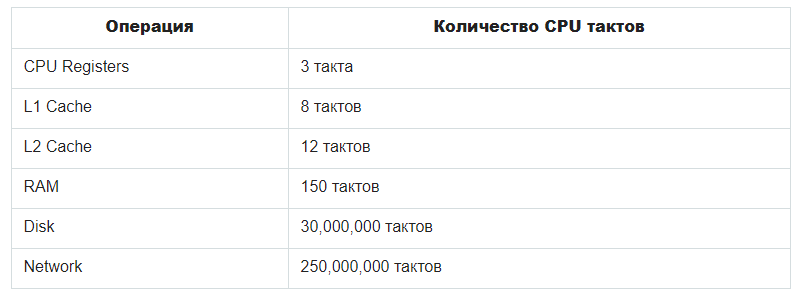

## Асинхронность

### IO (input/output)
IO (input/output) означает ввод/вывод
- input - получение информации от сетевых ресурсов
- output - вывод информации, например, сохранение на диск или запись в файл

Это самые затратные по времени этапы работы программы


### Блокирующий IO
Операции input/output происходят синхронно, одна за другой
```js
const connection = db.connect();	// подключаемся к базе данных
const users = connection.query('SELECT * FROM users'); // делаем запрос
console.log(users); // выводим информацию в консоль

```
Это простой в реализации, но очень затратный по времени вариант - программа ждёт 250 миллионов тактов процессора, пока не произойдёт подключение к базе данных.  
Вторая проблема синхронного IO - он не отказоустойчив. Если программа не сможет подключиться к базе данных, или если в базе данных не найдётся затребованной информации, программа остановит свою работу.

Синхронный или блокирующий IO в Node.js используется очень редко
- если необходимо получить данные, без которых работа программы не может начаться. Например, информацию о настройках
- может использоваться в консольных приложениях, у которых только один пользователь

### Неблокирующий IO
Неблокирующий IO происходит асинхронно
```js
db.connect((error, connection) => {
  if (error) throw error;
  connection.query('SELECT * FROM users', users => {
    console.log(users);
  });
});
```
В данном примере программа выполняет только один метод `db.connect()` и переходит к выполнению оставшейся части кода. Когда весь код выполнен, программа возвращается к `db.connect()`.

Первым аргументом `db.connect()` является ошибка. Если значение ошибки `true`, асинхронная функция выбрасывает ошибку и прекращает свою работу. Если ошибки нет - значение ошибки `false` - функция переходит к работе с базой данных: выполняет `connection.query()` и `console.log()`.

// TODO добавить задание на асинхронность - переписать синхронную функцию асинхронно